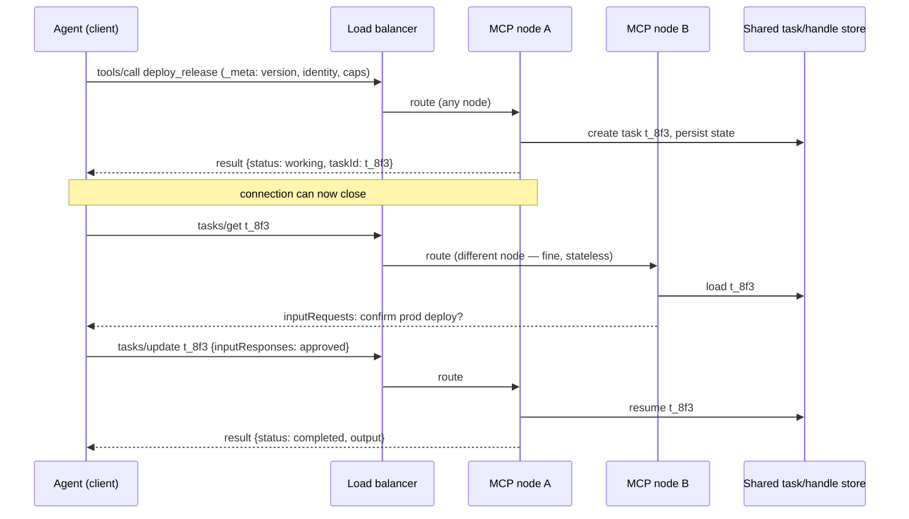

If you built an MCP server in 2025, you built it on a stateful, session-oriented protocol: a client opens a connection, runs an `initialize` handshake, the server mints an `Mcp-Session-Id`, and every subsequent call rides that session. Tool lists were allowed to vary per-connection. The server could reach back to the client mid-call for sampling, elicitation, or roots.

The spec is in the process of deleting almost all of that.

The **2025-11-25** revision introduced durable **tasks**. The current **draft** (post-2025-11-25) goes much further: it removes protocol-level sessions, removes the `initialize` handshake entirely, replaces server-initiated requests with a round-trip pattern, and **deprecates Sampling, Roots, and Logging outright**. This is not a point release. It is a re-architecture of the protocol around the observation that agents run in load-balanced, serverless, frequently-restarting environments — and that the stateful session model was fighting that the whole time.

This post is about what actually changed, why it changed, and how to build a server now that survives the transition. It assumes you have shipped an MCP server and hit its limits. Reference points are the published **2025-11-25** revision and the **draft** changelog as of June 2026 (SEPs 2575, 2322, 2663, 2577 are the load-bearing ones).


## 1. The two shifts that matter

Strip away the schema churn and there are exactly two architectural moves. Everything else follows from them.

**Shift one — statelessness.** Draft SEP-2575 removes the `initialize`/`notifications/initialized` handshake and the `Mcp-Session-Id` header. Every request now self-describes: it carries its protocol version, client identity, and client capabilities in `_meta`:

```
io.modelcontextprotocol/protocolVersion
io.modelcontextprotocol/clientInfo
io.modelcontextprotocol/clientCapabilities
```

`tools/list`, `resources/list`, and `prompts/list` are no longer allowed to vary per-connection. If a server needs cross-call state, it must mint an **explicit, opaque handle** and hand it back as an ordinary tool argument — the protocol will no longer carry that state for you.

**Shift two — durable tasks.** Introduced experimentally in 2025-11-25 (SEP-1686), redesigned in the draft as the `io.modelcontextprotocol/tasks` extension (SEP-2663). A tool call no longer has to block until it finishes. The server can return a **task handle** immediately; the client polls `tasks/get` and supplies further input through `tasks/update`. The blocking `tasks/result` method is gone.

These two are the same idea viewed from two angles. *Connections are no longer the unit of continuity.* In the old model, the TCP/SSE connection was the thread that tied a long operation, a session, and a pending sampling request together. The new model says: connections are disposable, and anything durable must be named by a server-minted handle that any node behind your load balancer can resolve.


## 2. Why the session model was a production liability

If you ran a session-based HTTP MCP server behind more than one replica, you already paid for this. Three concrete costs:

**Sticky routing.** `Mcp-Session-Id` meant session affinity. Either every replica shared a session store (Redis, and now session state is a distributed-systems problem), or your load balancer pinned each client to one node. Pinning means a deploy or a pod eviction silently invalidates live sessions, and your p99 includes the cost of clients re-initializing into the survivors.

**The initialize tax.** Every new connection paid a round-trip handshake before it could do useful work. For an agent that opens short-lived connections — which is most of them, especially serverless — that handshake was pure latency with no payload.

**Server-initiated requests broke the request/response model.** Sampling (`sampling/createMessage`), elicitation (`elicitation/create`), and roots (`roots/list`) required the server to send a request *to the client* mid-tool-call. That only works if the connection is bidirectional and pinned for the duration. It is hostile to any stateless gateway, any request-scoped autoscaler, and any audit pipeline that assumes calls flow one direction.

The draft's answer to the third problem is **Multi Round-Trip Requests (MRTR, SEP-2322)**. Instead of the server calling back, a tool result can include an `inputRequests` block describing what it still needs. The client gathers it and resubmits with `inputResponses` on the next request. Same outcome — the server gets the sampled completion or the user's confirmation — but it is now an ordinary forward request the client drives, not a reverse channel the connection has to hold open.



The point of the diagram is the two unlabelled facts: the second request lands on a *different node* and it works, and the connection *closes* between steps. Neither was safely true under sessions.


## 3. What this does to credential and security boundaries

Statelessness moves the security-relevant state out of the connection and into two places: the per-request token, and the server-minted handle. Both need treating as capabilities.

**The token still does the heavy lifting — and the rules tightened.** None of the 2025-06-18 authorization model is rolled back. You are still an OAuth 2.1 resource server; clients still send RFC 8707 resource indicators so a malicious server cannot harvest a token minted for someone else; you still validate the token audience on every call. The draft adds two bindings worth calling out:

- **`iss` validation (RFC 9207, SEP-2468).** Authorization servers SHOULD return `iss` in the authorization response, and clients MUST validate it against the recorded issuer before redeeming the code. This closes a mix-up class where a code issued by one AS is redeemed against another.
- **Credentials are keyed to the issuer (SEP-2352).** Clients MUST key persisted credentials by issuer identifier and MUST NOT reuse them across authorization servers. Practically: your client's token cache key is `(issuer, audience)`, never just `audience`.

Because every request is now self-contained and audience-bound, the security model is actually *cleaner* than sessions — there is no long-lived ambient session identity to steal. The auth decision is made fresh, per call, against a token whose audience you verify. That is the property you want.

**The new exposure is the task handle.** A task handle (`t_8f3` above) is a bearer reference to durable, possibly privileged, work. Anyone who can present it can poll its result and push input into it via `tasks/update`. Treat it accordingly:

- Make it high-entropy and unguessable. It is a capability, not a database row ID. Never `task-1027`.
- **Bind the handle to the authenticated principal.** On `tasks/get` and `tasks/update`, re-check that the token's subject matches the principal that created the task. Statelessness means you cannot lean on a session to remember "this connection owns this task" — you must check it explicitly, every call. Skipping this is an IDOR on long-running privileged operations.
- Give handles a TTL and expire the underlying state. A durable task that fronts a production deploy should not be resumable a week later.

**Trace context is now in-band.** The draft documents OpenTelemetry propagation through `_meta` keys (`traceparent`, `tracestate`, `baggage`, SEP-414). This is a genuine win for the audit problem agents create: a single agent turn can now carry one trace ID across the client, the gateway, the MCP server, and the downstream API it wraps. Build your spans around it from day one — retrofitting trace correlation onto an agent fleet after an incident is miserable.


## 4. Concrete wire-level shape

Here is the difference at the level you will actually debug. A stateful 2025-06-18-style call carried a session header and assumed an earlier handshake:

```bash
# Old: session-oriented. Mcp-Session-Id from a prior initialize.
curl -sS https://mcp.internal.example/rpc \
  -H "Authorization: Bearer $TOKEN" \
  -H "Mcp-Session-Id: 7c4a8d09ca37" \
  -H "MCP-Protocol-Version: 2025-06-18" \
  -d '{"jsonrpc":"2.0","id":1,"method":"tools/call",
       "params":{"name":"deploy_release","arguments":{"service":"checkout"}}}'
```

The draft-shaped call carries no session, no prior handshake — identity and capabilities ride in `_meta`, and required MCP headers (`Mcp-Method`, `Mcp-Name`, SEP-2243) are explicit:

```bash
# Draft: stateless. Self-describing request, no session, no initialize.
curl -sS https://mcp.internal.example/rpc \
  -H "Authorization: Bearer $TOKEN" \
  -H "Mcp-Method: tools/call" \
  -H "Mcp-Name: deploy_release" \
  -H "traceparent: 00-4bf92f3577b34da6a3ce929d0e0e4736-00f067aa0ba902b7-01" \
  -d '{"jsonrpc":"2.0","id":1,"method":"tools/call",
       "params":{
         "name":"deploy_release",
         "arguments":{"service":"checkout"},
         "_meta":{
           "io.modelcontextprotocol/protocolVersion":"DRAFT",
           "io.modelcontextprotocol/clientInfo":{"name":"acg-agent","version":"3.1"},
           "io.modelcontextprotocol/clientCapabilities":{"tasks":{}}
         }}}'
```

A server that supports tasks does not block. It returns a handle:

```json
{ "jsonrpc":"2.0","id":1,
  "result":{
    "status":"working",
    "task":{"taskId":"t_8f3c1e","pollInterval":2000},
    "ttlMs": 600000, "cacheScope": "private" } }
```

The client polls, on any node behind the LB:

```bash
curl -sS https://mcp.internal.example/rpc \
  -H "Authorization: Bearer $TOKEN" \
  -H "Mcp-Method: tasks/get" \
  -d '{"jsonrpc":"2.0","id":2,"method":"tasks/get",
       "params":{"taskId":"t_8f3c1e"}}'
```

If the tool needs a human confirmation before it touches production, it does not call back over a reverse channel. It returns `inputRequests`, and the client answers with `tasks/update` carrying `inputResponses`. That confirmation is now an ordinary, auditable, forward request — which is exactly what you want gating a prod deploy.

Note `ttlMs` and `cacheScope` (SEP-2549) on list/read results. They are freshness hints that let clients cache `tools/list` and cut polling — and the draft asks servers to return tools in **deterministic order** so the client (and the model's prompt cache) gets stable hits. For an agent that re-lists tools on every short-lived connection, deterministic ordering plus a TTL is a real token and latency saving, not a micro-optimisation.


## 5. A production failure mode: the long-poll connection pool collapse

The most expensive failure in this transition is not security — it is resource exhaustion from getting the *durability* model half-right.

The seductive shortcut when you adopt tasks is to keep the old blocking ergonomics: accept the `tools/call`, then hold the HTTP response open and internally long-poll your own backend until the task finishes, only *then* returning. It looks like tasks to the client and avoids teaching the client to poll. It also quietly recreates every problem statelessness was meant to kill.

Here is the cascade we have watched happen. A deploy tool wraps a pipeline that normally takes 90 seconds. One day a downstream dependency slows and pipelines start taking 8–10 minutes. Every held-open `tools/call` now occupies:

- one inbound HTTP connection and its worker/goroutine on the MCP node,
- one connection pinned through the load balancer (defeating stateless routing — the LB cannot move a held request),
- one upstream connection to the pipeline API.

An agent fleet retries on timeout. Retries open *more* held connections against the same slow backend. Connection pools saturate, health checks (which need a free worker) start failing, the orchestrator evicts "unhealthy" pods, and the held tasks on those pods are lost because the durable state lived in the connection, not the store. You have manufactured a correlated outage out of one slow dependency.

The fix is to actually be stateless: return the task handle *immediately*, persist task state to the shared store, let the connection close, and make the client poll `tasks/get` on a `pollInterval` you set. A held connection is the old session model wearing a task's clothes. The whole point of SEP-2663 dropping the blocking `tasks/result` method is to stop you from building this.

Defensive measures that belong in the design, not the postmortem:
- Hard ceiling on concurrent held connections per node, shed load with `503` before pools saturate.
- Persist task state on creation, before doing any work — so a pod eviction loses a connection, not the task.
- Make `tasks/get` idempotent and cheap; it will be your highest-QPS method once the fleet adopts polling.
- Separate the health-check path from the worker pool that serves tool calls.


## 6. Architectural trade-offs you are actually choosing

Statelessness and tasks are not free. The honest trade-offs:

**Server complexity moves, it does not vanish.** The protocol stops carrying your state, so *you* carry it — in a store every replica can reach. You have traded protocol-level sessions for an application-level task/handle store with its own consistency, TTL, and IDOR-checking obligations. For a single-replica internal tool this is pure overhead; statelessness pays off precisely when you have many replicas or serverless cold-starts, which is where the session model hurt most. Match the model to the deployment.

**Polling vs. streaming.** Tasks favour polling. Polling is robust, load-balancer-friendly, and trivially resumable, but it adds latency (bounded by `pollInterval`) and request volume. For genuinely streaming output — token-by-token generation, live logs — the draft keeps `subscriptions/listen`, a single long-lived POST-response stream clients opt into. Use tasks for *durable* work, subscriptions for *streaming* work. Conflating them gets you the latency of polling and the connection cost of streaming at once.

**Sampling deprecation forces an integration decision.** With Sampling, Roots, and Logging deprecated (SEP-2577), the suggested migrations are blunt: integrate directly with an LLM provider API instead of Sampling; pass directories/URIs as tool parameters instead of Roots; log to stderr or OpenTelemetry instead of Logging. If your server leaned on `sampling/createMessage` to borrow the client's model, you now own that integration — including its credentials and its cost. That is a real bill, but it also removes a confused-deputy surface (the server steering the client's model), so it is a security simplification as much as a cost.

**Adopting the draft early vs. waiting.** The draft is a moving target; 2025-11-25 is published and stable. The defensible position for production is: build on 2025-11-25's published surface, but *design* as if sessions are already gone — keep durable state in an external handle store, avoid per-connection tool lists, and don't add new dependencies on Sampling/Roots/Logging. That way the draft, when it lands, is a transport-layer change and not a rewrite. The twelve-month deprecation window (SEP-2596) gives you room, but only if you stop digging the hole now.


## 7. Implementation checklist

Use this for a new server or a migration audit. Each item is a thing that breaks in production if skipped.

- [ ] **No per-connection tool lists.** `tools/list`, `resources/list`, `prompts/list` return the same set regardless of connection. Sort deterministically so clients and prompt caches get stable hits.
- [ ] **State lives in a shared store, never the connection.** Any cross-call continuity is a server-minted, high-entropy, opaque handle resolvable by every replica.
- [ ] **Persist task state before doing work.** A pod eviction must lose a connection, not a task.
- [ ] **Bind handles to the principal.** Re-verify the token subject owns the task on every `tasks/get` and `tasks/update`. This is your IDOR defence.
- [ ] **Return task handles immediately; never hold the connection.** No internal long-poll dressed up as a task. Set `pollInterval`; let the client poll.
- [ ] **Validate token audience (RFC 8707) and `iss` (RFC 9207) on every call.** Cache client credentials keyed by `(issuer, audience)`, never audience alone.
- [ ] **Replace server-initiated requests with MRTR.** No new dependencies on `sampling/createMessage`, `elicitation/create`, or `roots/list` as reverse channels — return `inputRequests`, consume `inputResponses`.
- [ ] **Propagate trace context in `_meta`** (`traceparent`/`tracestate`/`baggage`); build spans that span client → gateway → server → downstream API.
- [ ] **Separate the health-check path from the tool-serving worker pool**, and shed load with `503` before connection pools saturate.
- [ ] **Set `ttlMs`/`cacheScope` on cacheable results**; expire durable task state on a TTL appropriate to its privilege.
- [ ] **Don't add new Sampling/Roots/Logging surface.** They are deprecated; integrate the LLM provider directly, pass paths as parameters, log to stderr/OTel.


## Closing

The quickstart-to-production gap in MCP used to be about transport choice and OAuth. That problem is solved and well-trodden. The gap that is open *now* is that the protocol's foundations are shifting under servers that were correct eighteen months ago. Sessions, the initialize handshake, and server-initiated sampling are on the way out, and the replacement — stateless, self-describing requests plus durable, externally-stored tasks — is a much better fit for how agents actually deploy.

You do not need to chase the draft. You need to stop building new dependencies on the parts of the protocol that are being removed, and move your durable state out of the connection and into a store today. Do that, and the spec catching up is a config change. Don't, and it is the second rewrite in two years.

*Spec references: MCP revision 2025-11-25 (published) and the post-2025-11-25 draft changelog — SEP-2575 (statelessness), SEP-2322 (MRTR), SEP-2663 (tasks extension), SEP-2577 (Sampling/Roots/Logging deprecation), SEP-2468/2352 (auth bindings), SEP-2549/414 (caching, trace context).*
