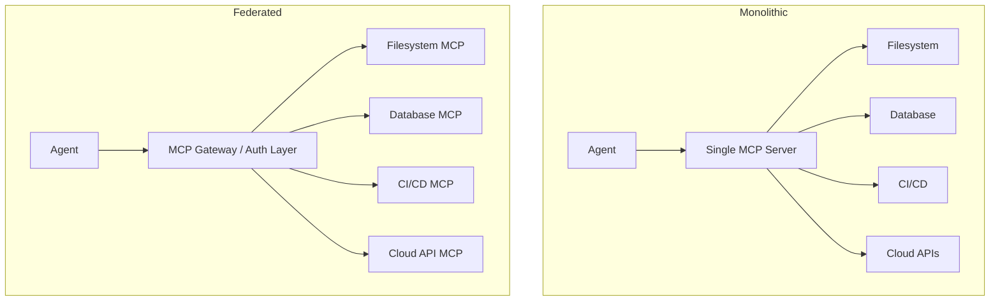

Every engineering team building agentic systems in 2026 has an MCP demo. Few have one in production. The gap is wider than most expect, and it's not closed by prompting — it's closed by architecture.

This post skips the "what is MCP" tutorial. If you're here, you've built something. These are the decisions that determine whether that something survives contact with production load, real data volumes, and engineers who weren't in the room when the prototype was written.


## Transport Layer: The Decision You're Probably Getting Wrong

The first architectural decision is the one most teams make by accident.

**stdio** binds the server lifecycle to the client process. One client, one server. The server spawns when the client starts and dies when it exits. This is correct for local developer tooling — Claude Code talking to a filesystem MCP on a developer's workstation. It is incorrect for anything else.

**SSE (Server-Sent Events)** decouples server from client. Your MCP server runs as an independent service, accepts connections over HTTP, and is network-addressable. This is the production model: multiple agents in a Kubernetes cluster sharing a common toolset, or a central internal-tools server serving an engineering org.

```bash
# stdio — launched by client, one-to-one, not independently addressable
npx @modelcontextprotocol/server-filesystem /mnt/workspace

# SSE — independently deployed, horizontally scalable
uvicorn internal_tools.mcp_server:app --host 0.0.0.0 --port 8080 --workers 4
```

The common mistake: start with stdio in a PoC because it's two fewer config lines, ship to production without migrating, and then discover you can't scale the tool server independently of the agent fleet. SSE from the start costs nothing in a local dev setup — you just point the client at `localhost`.


## Context Window Economics in Tool Chains

Tool results accumulate in the context window across a multi-step agentic workflow. At 200k tokens this sounds like headroom. It isn't, once you add real data volumes.

A single tool call returning raw log output from a busy service can consume 30–50k tokens. Chain three such calls — fetch logs, query a database, call an external API — and you've burned most of your available window before the model has produced any meaningful output. What follows is degraded reasoning on a truncated view of the task.

**The rule: tools do the heavy lifting server-side. They return summaries and structured signals, not raw data.**

```python
# Naive — full log file returned to model; lethal at any real log volume
@mcp.tool()
def get_service_logs(service: str) -> str:
    return Path(f"/var/log/{service}.log").read_text()

# Production — filter, structure, and summarise before returning
@mcp.tool()
def get_service_logs(
    service: str,
    level: Literal["ERROR", "WARN", "INFO"] = "ERROR",
    limit: int = 20,
    since_minutes: int = 60,
) -> str:
    cutoff = datetime.utcnow() - timedelta(minutes=since_minutes)
    entries = parse_structured_log(f"/var/log/{service}.log")
    filtered = [
        e for e in entries
        if e["level"] == level and e["ts"] >= cutoff
    ][-limit:]
    return json.dumps({"count": len(filtered), "entries": filtered}, indent=2)
```

The second form also gives the model higher-quality signal. Twenty structured error objects it can reason about beats 50k lines of mixed output every time.


## Idempotency Is Not Optional

Models retry tool calls. Network partitions happen. The same tool may execute twice with identical inputs within a single agentic turn. If your tool mutates state — triggers a deployment, creates a database record, posts to an external API — a non-idempotent implementation is a production incident waiting to happen.

The MCP specification does not enforce idempotency. That is your responsibility.

```python
@mcp.tool()
def trigger_deployment(
    service: str,
    version: str,
    environment: Literal["staging", "production"],
    request_id: str,  # caller-supplied; model generates this once per intent
) -> str:
    if record := idempotency_store.get(request_id):
        return f"Already executed [{request_id}]: {record}"

    result = run_deploy(service, version, environment)
    idempotency_store.set(request_id, result, ttl_hours=24)
    return result
```

The `request_id` pattern works because models, when instructed, will generate a stable identifier per intended action and reuse it on retries. Add this to your system prompt: *"Generate a UUID for each distinct action you intend to take and reuse it if you retry that action."*


## Monolithic vs Federated: A Team Topology Question



**Monolithic**: one server, all tools. Simpler auth model, simpler client configuration, one deployment to manage. Single point of failure. Cannot scale filesystem I/O independently from database access. All tool surface area is owned by whoever owns the server.

**Federated**: each domain has its own independently-deployed, independently-scalable server. Failure is isolated. Teams own their tool surface. Client configuration complexity grows linearly with server count and you'll want a gateway layer for centralised auth, routing, and rate-limiting.

The right answer tracks team topology. If the platform team and the data team are separate organisations, federated is the only answer that lets both iterate without cross-team coordination on every schema change. If it's one team and five tools, start monolithic and split when the seams become obvious.


## Tool Schema Precision Determines Calling Behaviour

The JSON Schema you publish is your API contract with the model. Ambiguity in the schema translates directly to inconsistent, unpredictable tool calls at runtime.

```typescript
// Vague — model improvises; calling behaviour varies across runs
server.tool("run_query", { params: z.object({}).passthrough() }, handler)

// Precise — deterministic calling behaviour, constrained option space
server.tool("run_query", {
  database:   z.enum(["analytics", "transactional", "audit"])
               .describe("Target database cluster"),
  query:      z.string().max(2000)
               .describe("Read-only SQL SELECT statement. No DDL or DML."),
  timeout_ms: z.number().int().min(100).max(30_000).default(5_000),
}, handler)
```

Enums eliminate the model's ability to hallucinate invalid values. `.describe()` delivers inline context without consuming system prompt tokens. `.max()` on string inputs is a cheap guard against prompt injection via crafted tool arguments — worth adding to every string parameter that reaches a database or shell.


## Observability: Log Before You Need To Debug

Without structured telemetry on tool calls, debugging a failed agentic workflow — one that chained eight tool calls over 90 seconds and produced the wrong output — is archaeology.

```python
@contextmanager
def tool_span(tool_name: str, inputs: dict):
    start = time.perf_counter()
    error = None
    try:
        yield
    except Exception as e:
        error = type(e).__name__
        raise
    finally:
        logger.info("mcp_tool_call", extra={
            "tool":          tool_name,
            "duration_ms":   round((time.perf_counter() - start) * 1000, 1),
            "input_keys":    list(inputs.keys()),   # log shape, not values
            "error":         error,
            "session_id":    current_session_id(),
        })
```

Emit to your existing log aggregator (Loki, Datadog, Splunk — doesn't matter) and build a dashboard over `mcp_tool_call` events. P95 duration per tool name tells you where latency comes from. Error rate by tool name tells you what's flaky. Result token estimates tell you what's burning your context window.


## What's Production-Ready Now

MCP is stable enough for production internal tooling: developer platforms, internal data access layers, CI/CD integration, knowledge base retrieval. Build these with confidence.

It is not yet mature enough for unattended, externally-facing agents operating without a human approval gate on high-risk tool categories. Deployments, schema migrations, and anything that writes to external state should sit behind an explicit confirmation step until your observability and rollback story is solid.

The teams moving fastest are treating MCP servers the same way they treat microservices: versioned contracts, independent deployments, structured logging, and explicit owners. The teams stalling are treating it as a prompting problem.


*Ivan Ocampo (Ph.D.) is a Solutions Architect and researcher working at the intersection of enterprise infrastructure and applied AI systems. [Get in touch](mailto:ivan@ivanocampo.com) or find me on [LinkedIn](https://linkedin.com/in/ivan-campo-a5a03316b).*
